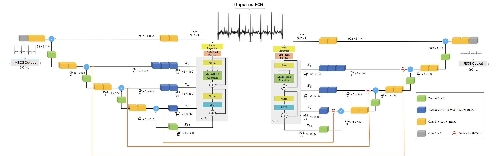
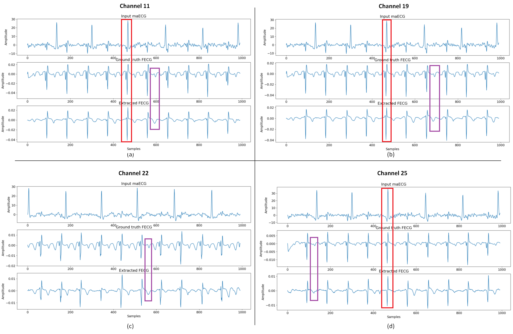
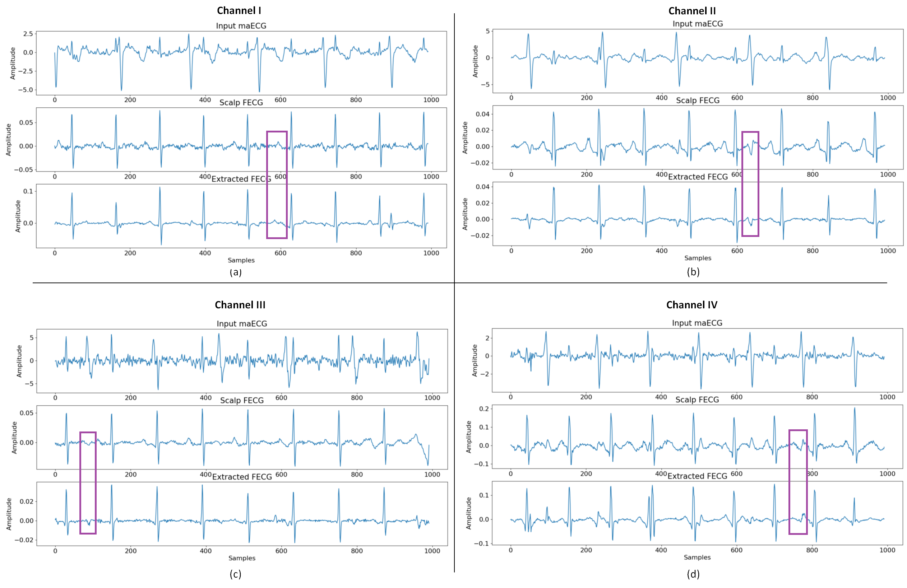

- W-NETR is based on MONAI 0.7.0 : PyTorch-based, open-source frameworks for deep learning in healthcare signals. 
(https://github.com/Project-MONAI/MONAI)
https://arxiv.org/abs/2103.10504

*******************************************************************************
## Requirements
Follow the steps in "installation_commands.txt". Installation via Anaconda and creation of a virtual env to download the python libraries and pytorch/cuda.
*******************************************************************************
## Python scripts and their function

- fetal-ecg-synthetic-database-1.0.0/generate_dataset.py: Organize the data in the folder structure (fecg_ground,mixture,mecg_ground) for the network. 

- init.py: List of options used to train the network. 

- networks.py: The W-NETR architecture for FECG extraction testing on simulation dataset.
- networks_real.py: The W-NETR architecture for FECG extraction testing on real dataset.

- test_simulation.py: Runs the testing on simulation dataset.
- test_real.py: Runs the testing on real dataset.

*******************************************************************************
## Usage
### Folders structure:

First download the "fetal-ecg-synthetic-database-1.0.0" dataset and place its "sub01", "sub02", ...., "sub10" folders in the "fetal-ecg-synthetic-database-1.0.0/" directory.

Second run the "fetal-ecg-synthetic-database-1.0.0/generate_dataset.py" and "ADFECGDB/generate_dataset_real.py" to create organize the simulation and real data, respectively.

Then run the "fetal-ecg-synthetic-database-1.0.0/Dataset_gen2.py" and "ADFECGDB/Dataset_gen_real.py" to create the dataloader files for the simulation and real data, respectively.

Finally, download the trained simulation and real corresponding models from the following links:
-https://drive.google.com/file/d/1NljEmZJaBb4hT3sLJ_HFAJDJhEt4HoJv/view?usp=sharing
-https://drive.google.com/file/d/1wUzuZcAJmcaXPsYv-rgApjhke8mCuVZh/view?usp=sharing
*******************************************************************************
### Results:

The following plot show results on simulation dataset:

The following plot show results on real dataset:

### W-NETR Notes from the authors:

W-NETR paper with more descriptions is now publicly available. Please check for more details:
Almadani, Murad, Leontios Hadjileontiadis, and Ahsan Khandoker. "One-Dimensional W-NETR for Non-invasive Single Channel Fetal ECG Extraction." IEEE Journal of Biomedical and Health Informatics (2023).

